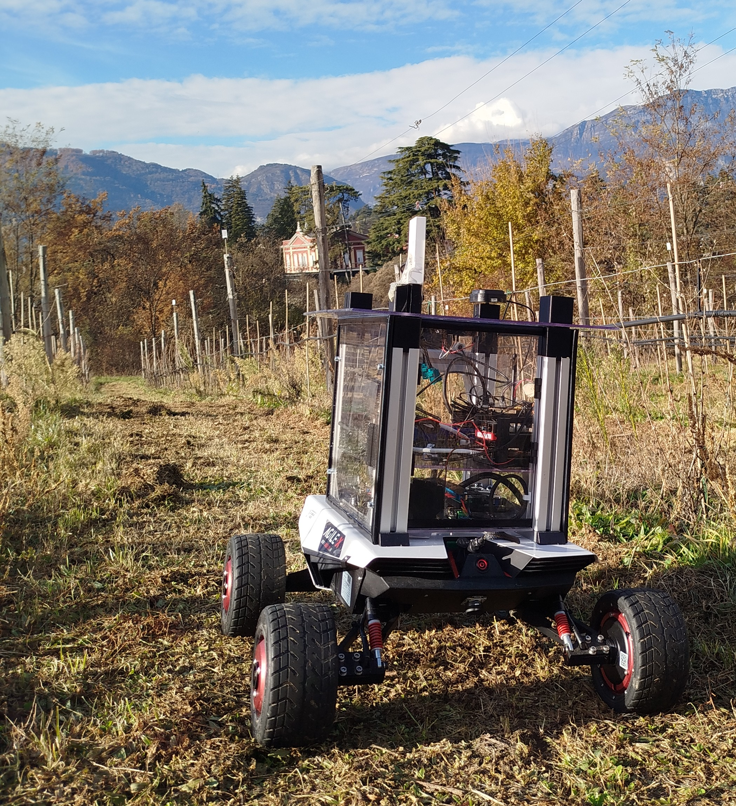
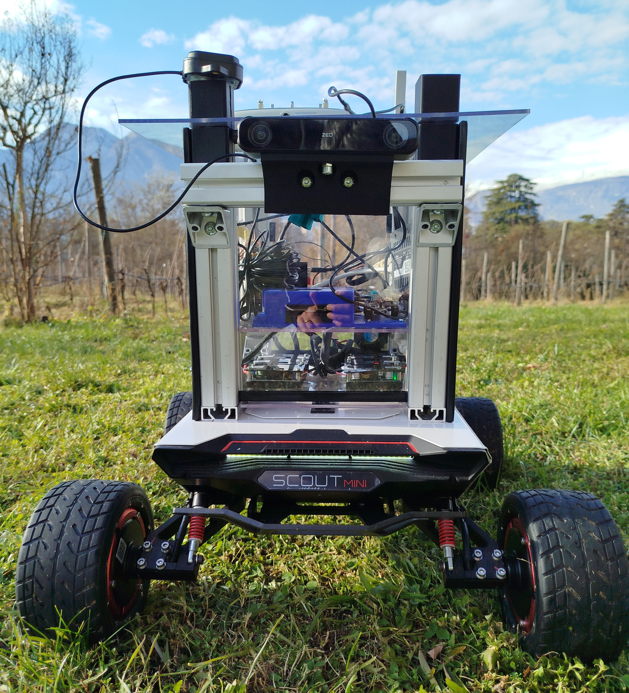
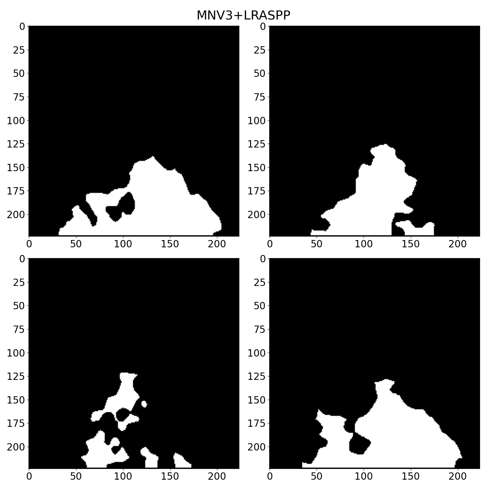
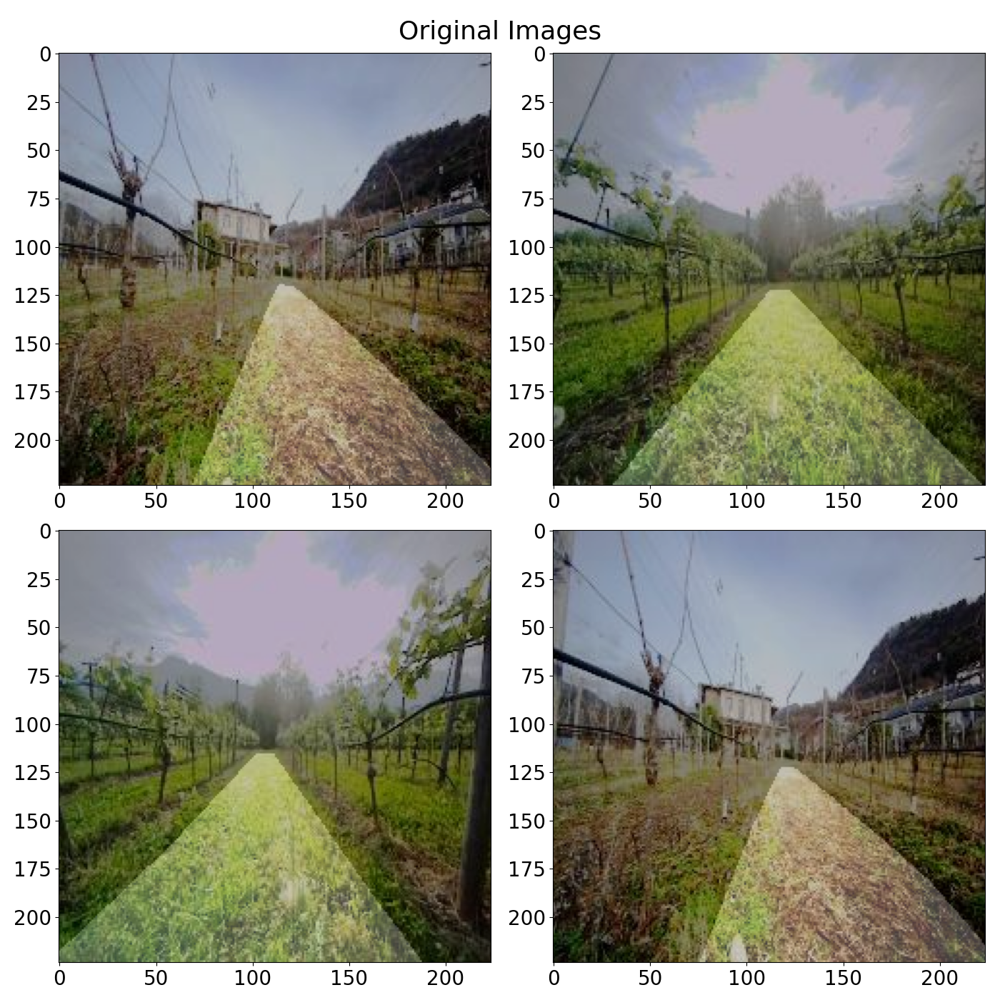
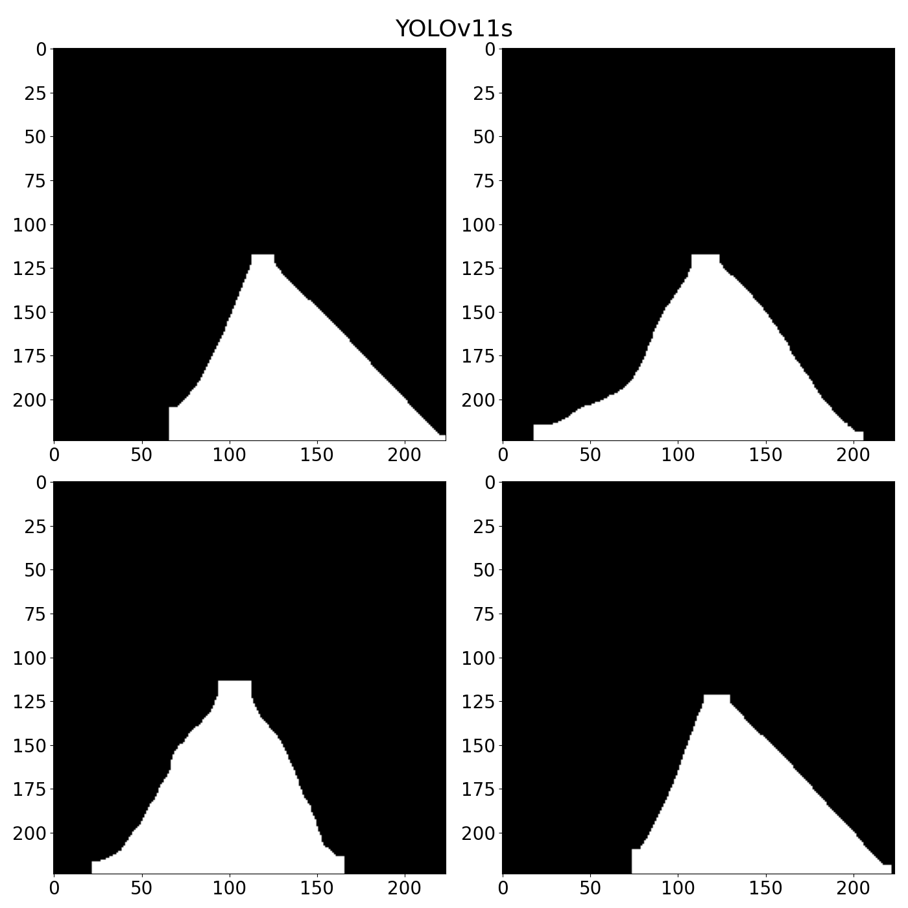
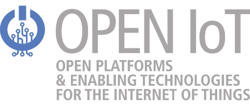

# Segmentation of Drivable Areas in GPS-Denied and Unstructured Orchard Environments
This repository contains the code and data representing outcomes of the paper "Segmentation of Drivable Areas in GPS-Denied and Unstructured Orchard Environments" accepted at [IEEE MetroInd4.0&amp;IoT 2025](https://www.metroind40iot.org/).

<p align="center">
  
</p>

## Abstract

Autonomous navigation in agricultural environments such as vineyards and orchards typically depends on sensor
fusion, integrating GPS, inertial measurement units (IMUs), Light Detection and Ranging (LiDAR), and stereo cameras for precise navigation. However, resource-limited edge devices and environmental factors like seasonal changes or GPS signal loss underscore the need for more efficient sensing solutions that can complement current technologies and reduce measurement uncertainties. These challenges, along with economic constraints and limited technical expertise, hinder the widespread adoption of robotic systems in farming. In this work, we explore and compare various deep learning-based segmentation methods for accurately detecting drivable areas in unstructured, GPS-denied orchard environments. Particular emphasis is placed
on deploying these methods to edge devices, where efficient model inference is critical. We analyze three deep learning-based segmentation methods: a lightweight DeepLabv3-inspired model and the two latest YOLO (You Only Look Once) versions for segmentation. Our results demonstrate the feasibility of deploying
these models on edge devices such as NVIDIA Jetson Orin Nano and the superior performance of the YOLO models, achieving high terrain segmentation precision and season-robust real-time inference on previously unseen data.

<p align="center">
  
  
  
</p>

## Set up
The [requirements.txt](/requirements.txt) file contains informations of the needed python libraries. The use of a virtual environment for the installation is suggested as a common good programming choice. For example, the use of pipenv requires the following commands
``` bash
  pipenv shell
  pipenv install -r requirements.txt
```

Specifically on the Jetson platform, installing torch and torchvision from [here](https://forums.developer.nvidia.com/t/pytorch-for-jetson/72048 ) (PyTorch v2.3.0, CUDA 12.2) and tensorflow from [here](https://developer.download.nvidia.com/compute/redist/jp/v60/tensorflow/tensorflow-2.16.1+nv24.07-cp310-cp310-linux_aarch64.whl) was needed.

## Usage and Results
In the [examples](/examples/) folder the main python scripts of this project can be found. The main objective of these scripts is applying Semantic Segmentation in the context of outdoor navigation.

By running
``` bash
python examples/seg_compare.py
```
a comparison between YOLOv8-seg, YOLOv11-seg, and MobileNetv3+LRASPP models will be triggered. Results of previous exections can be found in the [results](/results/) folder.

<p align="center">
  
  
  
  
  
</p>

## Aknowledgements and Citation

Data contained in this repository has been developed within the FBK research institute. It's usage has been agreed with the owner.

Copyright on the material in this webpage has been transferred to IEEE for MetroInd4.0&amp;IoT 2025: 
F. Girlanda, F. Shamsfakhr, M. Vecchio and F. Antonelli, "Segmentation of Drivable Areas in GPS-Denied and Unstructured Orchard Environments," 2025 IEEE International Workshop Metrology for Industry4.0 & IoT (MetroInd4.0&amp;IoT), Castelldefels, Spain, 2025.

A final version for the citation with DOI will be provided after pubblication.

This work was partially supported by the Interconnected Nord-Est Innovation Ecosystem (iNEST), founded by European Union Next-GenerationEU (PNRR, Missione 4 Componente 2, Investimento 1.5 – D.D. 105823/06/2022, Ecs00000043), and the AgrifoodTEF project of the Digital Europe Programme (GA #101100622).

<p align="center">
  
  
</p>
<p align="center">
  
</p>